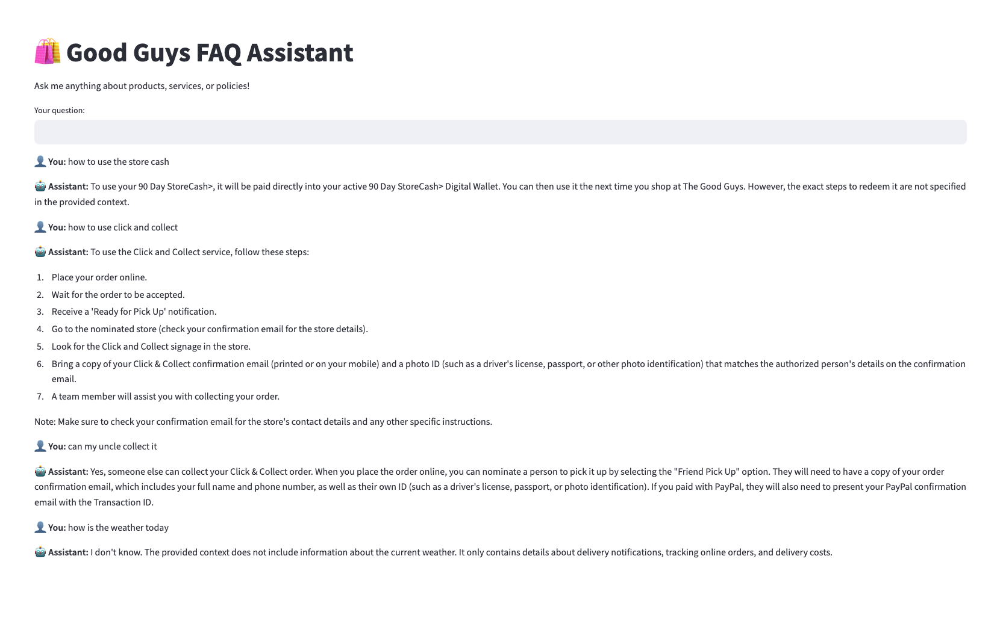

# E-commerce FAQ Assistant using RAG

This project implements a Retrieval Augmented Generation (RAG) based FAQ assistant for e-commerce using LangChain, Groq, and Chroma vector database. The assistant is trained on FAQ data from The Good Guys e-commerce platform, providing accurate and contextual responses to customer queries about products and services.

## Application Preview



The application provides a clean and intuitive chat interface where users can:
- Ask questions about products and services
- Get instant responses based on The Good Guys FAQ database
- View conversation history
- Experience natural, context-aware interactions

## Project Structure

```
├── src/                    # Source code
│   ├── app.py             # Main Streamlit application
│   └── data_processor.py  # Data processing and embedding logic
├── data/                  # Data files
│   ├── goodguys_faq.csv   # FAQ dataset
│   └── chroma_db/         # Vector database storage
├── assets/               # Static assets
│   └── ui_preview.png    # Application UI screenshot
├── requirements.txt      # Project dependencies
└── README.md            # Project documentation
```

## Setup

1. Create a virtual environment and activate it:
```bash
python -m venv .venv
source .venv/bin/activate  # On Windows, use `.venv\Scripts\activate`
```

2. Install the required dependencies:
```bash
pip install -r requirements.txt
```

3. Create a `.env` file in the root directory and add your Groq API key:
```
GROQ_API_KEY=your_groq_api_key_here
```

4. Place the Good Guys FAQ CSV file in the `data` directory. The CSV should have two columns:
   - `question`: The customer's question
   - `answer`: The corresponding answer from The Good Guys FAQ database

## Running the Application

Run the Streamlit application:
```bash
streamlit run src/app.py
```

The application will:
1. Load the Good Guys FAQ data from the CSV file
2. Create embeddings using HuggingFace's sentence-transformers
3. Store the embeddings in a Chroma vector database
4. Initialize the RAG pipeline with Groq's Llama model
5. Provide a chat interface for users to ask questions about products and services

## Features

- Semantic search using Good Guys FAQ data
- Conversational memory for context-aware responses
- Fast responses using Groq's Llama model
- User-friendly interface with Streamlit
- Accurate answers based on The Good Guys' official FAQ database

## Technologies Used

- LangChain for RAG implementation
- Groq's Llama model for LLM
- Chroma for vector storage
- HuggingFace embeddings
- Streamlit for the user interface

## Data Source

This application uses FAQ data from The Good Guys e-commerce platform, specifically focusing on the following key areas:

- Online Orders
- Delivery Services
- Click and Collect
- Store Cash

The FAQ data is processed and embedded to provide accurate and relevant responses to customer queries while maintaining the context and accuracy of The Good Guys' official information.

## Sample Questions

Here are some example questions you can ask the assistant:

- "How do I track my online order?"
- "How does Click and Collect work?"
- "Can I use store cash for online purchases?"
- "What do I need to bring for Click and Collect?"
- "How long is store cash valid for?"
- "What are the delivery charges?"